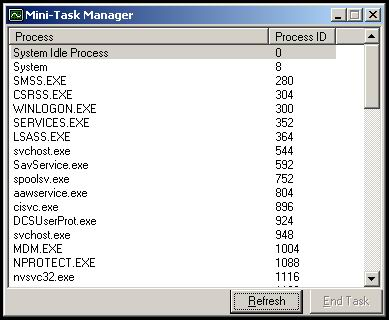



## Mini\-Task Manager

### Description

By combining my previous codes (display &amp; kill process), I've created a mini-task manager.

Just sharing. Enjoy!!
 
### More Info
 

             |
---                |---
**Submitted On**   |2008-03-17 18:19:46
**By**             |[Uchiha Yueh](https://github.com/Planet-Source-Code/PSCIndex/blob/master/ByAuthor/uchiha-yueh.md)
**Level**          |Intermediate
**User Rating**    |5.0 (10 globes from 2 users)
**Compatibility**  |VB 5\.0, VB 6\.0
**Category**       |[Complete Applications](https://github.com/Planet-Source-Code/PSCIndex/blob/master/ByCategory/complete-applications__1-27.md)
**World**          |[Visual Basic](https://github.com/Planet-Source-Code/PSCIndex/blob/master/ByWorld/visual-basic.md)
**Archive File**   |[Mini\-Task\_2106303172008\.zip](https://github.com/Planet-Source-Code/uchiha-yueh-mini-task-manager__1-70282/archive/master.zip)

